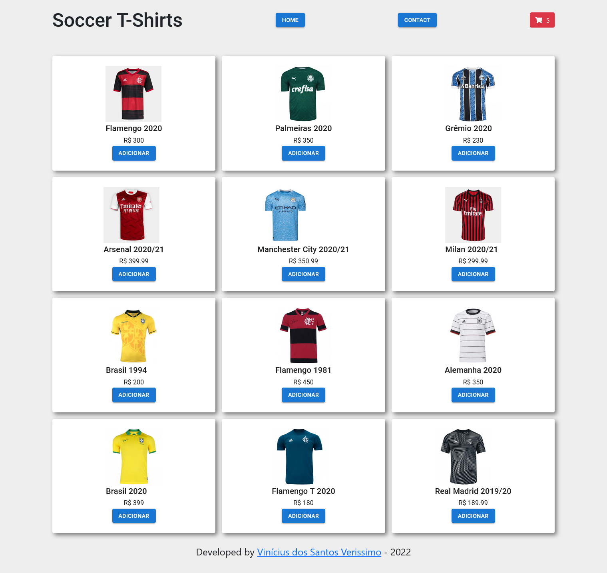

# Aplicação de E-Commerce usando React e Redux

## Visão Geral

### Screenshot

### Links

-   URL: em breve

## Meu processo

### Construído com

-   HTML5 semântico
-   CSS com Material UI
-   JavaScript
-   React
-   Redux

### O que aprendi

Neste projeto eu pude aplicar os conhecimentos envolvendo a biblioteca React para desenvolver um E-Commerce de camisetas de times de futebol, em que os itens podem ser adicionados ao carrinho, que exibe a listagem de itens adicionados, calcula sua quantidade unitária, seu valor total de acordo com a quantidade, e por fim a quantidade total de itens e o valor total da compra.

Utilizei o Redux para gerenciar os estados globais e compartilhá-los com os diferentes componentes da aplicação.

Projeto desenvolvido junto ao Bootcamp Impulso da Digital Innovation One.

## Autor

-   GitHub - Vinícius dos Santos Verissimo (https://github.com/viniciusdsv93)
